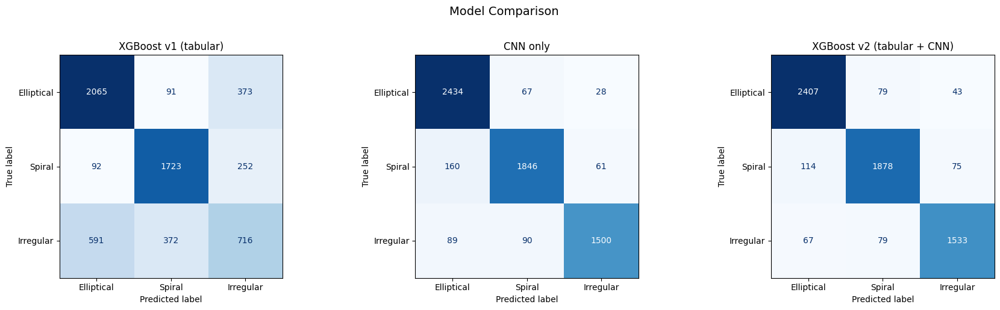

# 🌌 ELC Summer Internship 2025 — Galaxy Morphology Classification

Part of the Experiential Learning (EL) Summer Internship 2025 at **Thapar Institute of Engineering and Technology**.  
A multiwavelength galaxy morphology classification pipeline using AI/ML on Galaxy Zoo 2 data.

---

## Overview

This project builds an end-to-end pipeline to automatically classify galaxy morphologies (Elliptical, Spiral, Irregular) by cross-matching multi-wavelength catalogs, constructing a labeled image dataset, and training a machine learning classifier.

### Pipeline Steps

| Notebook | Description |
|----------|-------------|
| `1_Crossmatch.ipynb` | Cross-matches GZ2, GSWLC-A1, and photometric catalogs |
| `2_Filter.ipynb` | Filters candidate galaxies by quality cuts |
| `3_create_image_dataset.ipynb` | Builds labeled image crops from the GZ2 image archive |
| `4_Sanity_check_dataset.ipynb` | Validates dataset quality and class balance |
| `5_Analyze_final_dataset.ipynb` | Trains and evaluates the final classifier |
| `6_iteration_1.ipynb` | First iteration experiments and ablations |

---

## Galaxy Classes

| Label | Class | Description |
|-------|-------|-------------|
| 0 | Elliptical | Smooth, featureless, ellipse-shaped galaxies |
| 1 | Spiral | Disc galaxies with spiral arms |
| 2 | Irregular | Asymmetric or disturbed morphology |

---

## Dataset

The dataset is built by cross-matching three sources:

- **Galaxy Zoo 2 Images** — Volunteer-classified SDSS galaxy images  
- **Galaxy Zoo 2 Catalog** — Morphology vote fractions  
- **GALEX-SDSS-WISE Legacy Catalog (GSWLC-A1)** — Multiwavelength photometry (UV + optical + IR)

> ⚠️ Raw catalog files (`final_crossmatched.csv`, `final_gz2.csv`, `GSWLC-A1.csv`) exceed GitHub's 100 MB limit and are not included in this repository. See the References section for direct download links.

---

## Results



---

## Files in This Repository

```
├── 1_Crossmatch.ipynb
├── 2_Filter.ipynb
├── 3_create_image_dataset.ipynb
├── 4_Sanity_check_dataset.ipynb
├── 5_Analyze_final_dataset.ipynb
├── 6_iteration_1.ipynb
├── final_labelled.csv          ← Final labelled galaxy sample
├── gz2_filename_mapping.csv    ← GZ2 image filename index
├── columns_description.txt     ← Description of all dataset columns
└── sanity_plots.png            ← Dataset validation plots
```

---

## Requirements

```bash
pip install torch torchvision astropy matplotlib pillow numpy pandas scikit-learn xgboost
```

---

## References

1. **Galaxy Zoo 2 — Image Dataset**  
   Willett et al. (2013). Galaxy Zoo 2 image cutouts.  
   Zenodo. [https://zenodo.org/records/3565489](https://zenodo.org/records/3565489)

2. **Galaxy Zoo 2 — Morphology Catalog**  
   Willett et al. (2013). Galaxy Zoo 2: detailed morphological classifications for 304,122 galaxies from the Sloan Digital Sky Survey.  
   [https://data.galaxyzoo.org/#section-8](https://data.galaxyzoo.org/#section-8)

3. **GALEX-SDSS-WISE Legacy Catalog (GSWLC-A1)**  
   Salim et al. (2016). GALEX-SDSS-WISE Legacy Catalog of Galaxy Physical Properties.  
   MAST / STScI. [https://archive.stsci.edu/prepds/gswlc/](https://archive.stsci.edu/prepds/gswlc/)

---

## Acknowledgements

This work was carried out under the ELC Summer Internship 2025 programme at Thapar Institute of Engineering and Technology.
